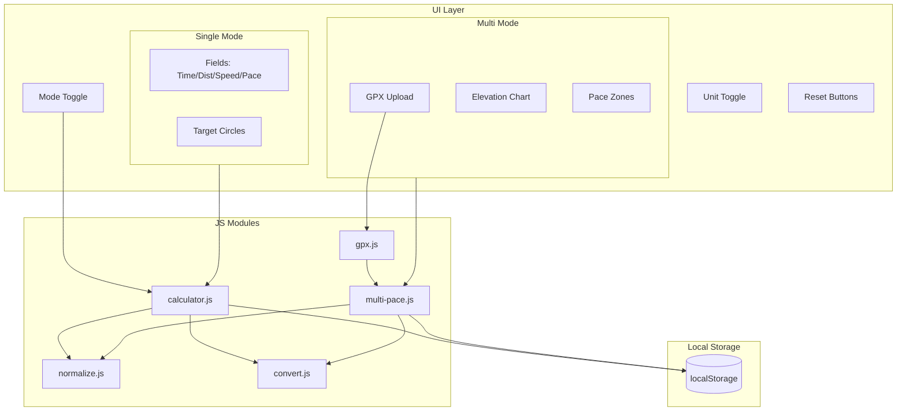

# DTS-Calc

**Distance–Time–Speed calculator for runners.** Features two distinct modes: a **Single** pace calculator (enter any two of time, distance, or speed/pace to compute the third) and a **Multi** pace workout planner (upload a GPX route, divide it into segments, and plan varying paces across elevation profiles). Metric and imperial units. Offline-first, static HTML with modular ES modules. Mobile-first layout with responsive design.

## Features

- **Two calculation modes**: Single pace (classic calculator) and Multi pace (GPX route planner)
- **Single Mode**:
  - Four linked fields: Time (HH:MM:SS), Distance (KM/MI), Speed (KM/H or MPH), Pace (MIN/KM or MIN/MI)
  - Target selector: TIME, DISTANCE, or SPEED — the selected target is computed from the others
- **Multi Mode**:
  - GPX Upload: Parse `.gpx` routes (5km to 45km) into 100m pace blocks
  - Elevation Chart: Visualise the route's elevation profile
  - Pace Zones: Select segments of the route and assign distinct paces to plan your final finishing time
  - Zone Controls: `+ Add Zone` and `Delete` actions to manage pace zones
- Unit toggle: METRIC (km, km/h, min/km) or IMPERIAL (mi, mph, min/mi)
- Smart input: digits auto-format to time (e.g. `123456` → `01:23:45`) or pace (e.g. `530` → `05:30`)
- Offline-first with localStorage persistence
- Reset: click clears values; long-press (≥500ms) factory resets
- Mobile-first frame (393×852), responsive on desktop
- Accessible: ARIA labels, focus-visible, high-contrast support

## Tech Stack

| Layer | Technology |
|-------|------------|
| UI | Static HTML, vanilla JS ES modules |
| Styling | CSS custom properties, JetBrains Mono font |
| Persistence | localStorage |
| Hosting | Vercel (static) |

## Architecture Overview



## Directory Structure

```
DTS-Calc/
├── index.html       # App entrypoint
├── css/
│   └── styles.css   # Extracted app styles
├── js/
│   ├── calculator.js
│   ├── normalize.js
│   ├── convert.js
│   ├── gpx.js
│   └── multi-pace.js
├── vercel.json      # Vercel rewrites (root → index.html)
└── README.md
```

## Routes

| Route | Purpose |
|-------|---------|
| `/` | Main calculator (rewrites to `index.html`) |

## Data Flow and Compute Model

- **Modes**: Toggling Single/Multi switches the UI shell and initializes the respective persistence logic.
- **Single Mode**:
  - **Input**: User edits a non-target field → debounced `compute()` (200ms)
  - **Blur**: Normalize value (time/pace auto-format from digits), then `compute()`
  - **Target**: TIME, DISTANCE, or SPEED — target field is read-only; others drive it
  - **Speed vs Pace**: When both time and distance exist, speed and pace stay in sync; `lastEdited` (PACE or SPEED) decides which drives the other
- **Multi Mode**:
  - **GPX Data**: GPX strings parsed and downsampled to 100m chunks. Elevation mapped onto segments.
  - **Planner**: Users define distinct paces for groups of segments ("Zones"), and a total run time is computed by accumulating segment durations.
- **Persistence**: `saveState()` / `loadState()` applied on init, compute, clear, and reset events for both modes separately.

## Key Concepts

- **Target field**: The computed value. TIME = from distance + speed/pace; DISTANCE = from time + speed/pace; SPEED = locks both speed and pace (derived from time + distance)
- **Unit conversion**: 1 mi = 1.609344 km; applied on toggle between METRIC and IMPERIAL
- **Digits-to-time**: Raw digits (e.g. `123456`) → `01:23:45` on blur
- **Digits-to-pace**: Raw digits (e.g. `530`) → `05:30` on blur

## Getting Started

**Prerequisites:** None (static HTML; open in browser or serve locally)

```bash
# Option 1: Open directly
open index.html

# Option 2: Local server (e.g. Python)
python3 -m http.server 8000
# Visit http://localhost:8000/index.html
```

**Deploy to Vercel:**

```bash
vercel
```

`vercel.json` rewrites `/` to `/index.html`.
