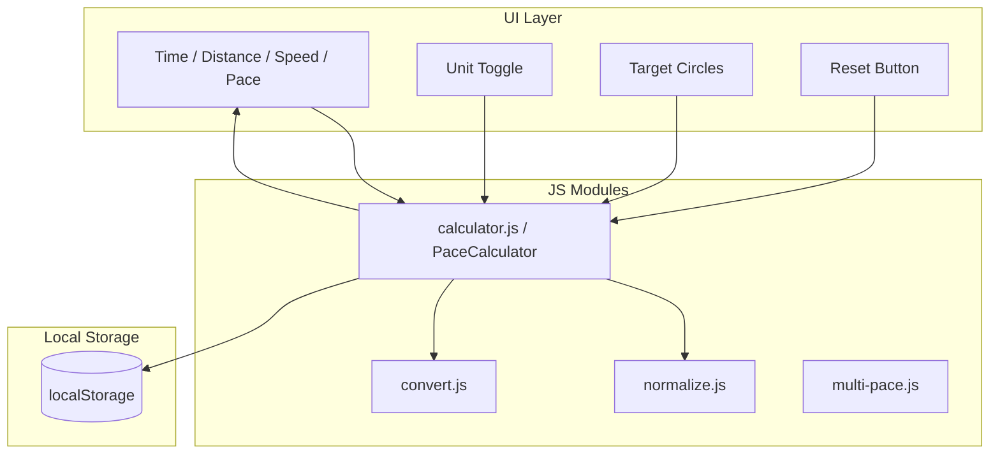

# DTS-Calc

**Distance–Time–Speed calculator for runners.** Enter any two of time, distance, speed, or pace; the third is computed. Choose which value is the target (Time, Distance, or Speed/Pace). Metric and imperial units. Offline-first, static HTML with modular ES modules. Mobile-first layout with responsive design.

## Features

- Four linked fields: Time (HH:MM:SS), Distance (KM/MI), Speed (KM/H or MPH), Pace (MIN/KM or MIN/MI)
- Target selector: TIME, DISTANCE, or SPEED — the selected target is computed from the others
- Unit toggle: METRIC (km, km/h, min/km) or IMPERIAL (mi, mph, min/mi)
- Smart input: digits auto-format to time (e.g. `123456` → `01:23:45`) or pace (e.g. `530` → `05:30`)
- Offline-first with localStorage persistence
- Reset: click clears values; long-press (≥500ms) factory resets target and unit system
- Mobile-first frame (393×852), responsive on desktop
- Accessible: ARIA labels, focus-visible, high-contrast support

## Tech Stack

| Layer | Technology |
|-------|------------|
| UI | Static HTML, vanilla JS ES modules |
| Styling | CSS custom properties, Handjet font |
| Persistence | localStorage |
| Hosting | Vercel (static) |

## Architecture Overview



## Directory Structure

```
DTS-Calc/
├── index.html       # App entrypoint
├── css/
│   └── styles.css   # Extracted app styles
├── js/
│   ├── calculator.js
│   ├── normalize.js
│   ├── convert.js
│   └── multi-pace.js
├── vercel.json      # Vercel rewrites (root → index.html)
└── README.md
```

## Routes

| Route | Purpose |
|-------|---------|
| `/` | Main calculator (rewrites to `index.html`) |

## Data Flow and Compute Model

- **Input**: User edits a non-target field → debounced `compute()` (200ms)
- **Blur**: Normalize value (time/pace auto-format from digits), then `compute()`
- **Target**: TIME, DISTANCE, or SPEED — target field is read-only; others drive it
- **Speed vs Pace**: When both time and distance exist, speed and pace stay in sync; `lastEdited` (PACE or SPEED) decides which drives the other when user edits one
- **Persistence**: `saveState()` after compute/clear/reset; `loadState()` on init

## Key Concepts

- **Target field**: The computed value. TIME = from distance + speed/pace; DISTANCE = from time + speed/pace; SPEED = locks both speed and pace (derived from time + distance)
- **Unit conversion**: 1 mi = 1.609344 km; applied on toggle between METRIC and IMPERIAL
- **Digits-to-time**: Raw digits (e.g. `123456`) → `01:23:45` on blur
- **Digits-to-pace**: Raw digits (e.g. `530`) → `05:30` on blur

## Getting Started

**Prerequisites:** None (static HTML; open in browser or serve locally)

```bash
# Option 1: Open directly
open index.html

# Option 2: Local server (e.g. Python)
python3 -m http.server 8000
# Visit http://localhost:8000/index.html
```

**Deploy to Vercel:**

```bash
vercel
```

`vercel.json` rewrites `/` to `/index.html`.
